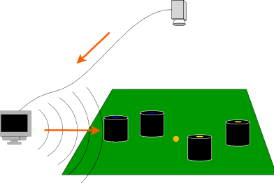

## リーグからのお知らせ
- ホームページをリニューアルしました。

## About RoboCup SSL
{: align=right width=30%}
RoboCup Soccer Small Size League は、小型のロボットでサッカーを行う競技です。特に小型リーグでは、非常に動的な環境でのマルチエージェントの協調と制御の問題に焦点を当てています。

フィールド上のロボット・ボールは、約6 m上にある複数カメラによって提供されるデータを処理する標準化されたビジョンシステムによって追跡され ます。ビジョンシステムは、リーグのコミュニティによって維持されているオープンソースプロジェクトです。

この競技では、多くのハードウェアおよびソフトウェアを巧妙に設計、実装し、堅牢なロボットシステムを構築する必要があります。

